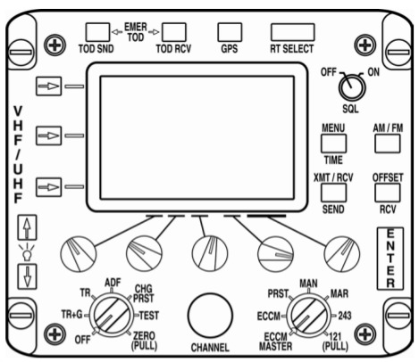

# ARC-210 Radio Control Panel for DCS A-10C II

This project replicates the look and functionality of the ARC-210 radio used in the A-10C II Warthog module for Digital Combat Simulator (DCS). It uses an **ESP32-S3** microcontroller, an **ILI9488 SPI display**, **rotary encoders**, and an optional **WS2812 (NeoPixel)** LED for status indication.

---

## 🧹 Features

* **Full-color splash screen** and **connection status warnings**
* **Text rendering** using Adafruit\_GFX and custom fonts
* **NO button matrix** for manual frequency input or mode selection
* **Up to 9 rotary encoders** for channel/volume controls
* **DCS-BIOS integration** (planned or active)
* **WS2812 RGB LED** to indicate device state (e.g., red for no DCS connection)

---

## 📷 Example Screens




---

## 📦 Hardware Used

* ✅ **ESP32-S3** (e.g., Lolin S3 Mini or DevKit)
* ✅ **3.5” ILI9488 SPI TFT Display**
* ✅ **16x momentary switches** in 4x4 matrix
* ✅ **Up to 9 rotary encoders** (2 pins each + common GND)
* ✅ **WS2812 LED** (optional)
* ✅ Resistors, wiring, Dupont connectors

---

## 📁 File Structure

```
ARC-210/
├── ARC210.ino              ← Main code
├── lib/
│   └── ILI9488-ESP32S3/
│       ├── ILI9488-ESP32S3.h
│       └── ILI9488-ESP32S3.cpp
├── Fonts/
│   ├── FreeSansBold24pt7b.h
│   └── FreeSans50pt7b.h
├── images/
│   └── splash_screen.jpg
├── docs/
│   └── button_matrix_layout.png
└── README.md
```

---

## 🔧 Setup Instructions

1. **Install the following Arduino libraries**:

   * Adafruit GFX
   * Adafruit BusIO
   * Adafruit NeoPixel
   * SPI
   * My custom ILI9844 diplay library - https://github.com/dgdimick/ILI9488-ESP32S3-Fast

2. **Connect your display**:

   ```
   TFT_CS   → GPIO 10
   TFT_DC   → GPIO 9
   TFT_RST  → GPIO 8
   MOSI     → GPIO 11
   SCK      → GPIO 12
   ```

3. **Define your switch matrix pins** and connect accordingly.

4. **Compile and upload** using Arduino IDE or PlatformIO with `esp32s3` board selected.

---

## 🔒 License

MIT License – See [LICENSE](LICENSE) file.

---

## 🙏 Credits

* Original ILI9488 library by Adafruit, modified for ESP32-S3 by Jaret Burkett.
* This project is maintained by [Denis Dimick](mailto:dgdimick@gmail.com).
